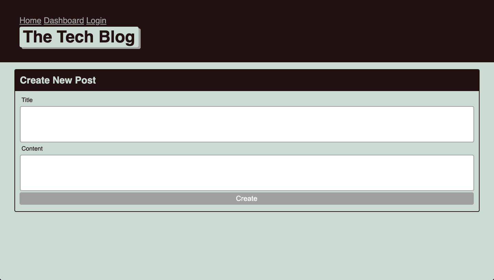
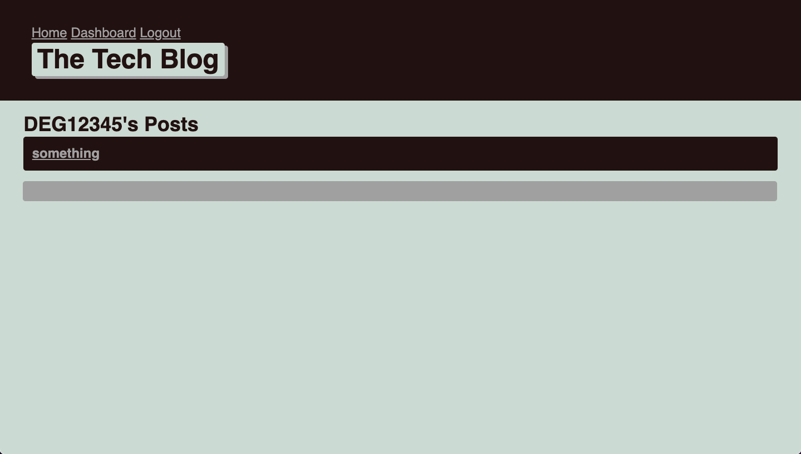
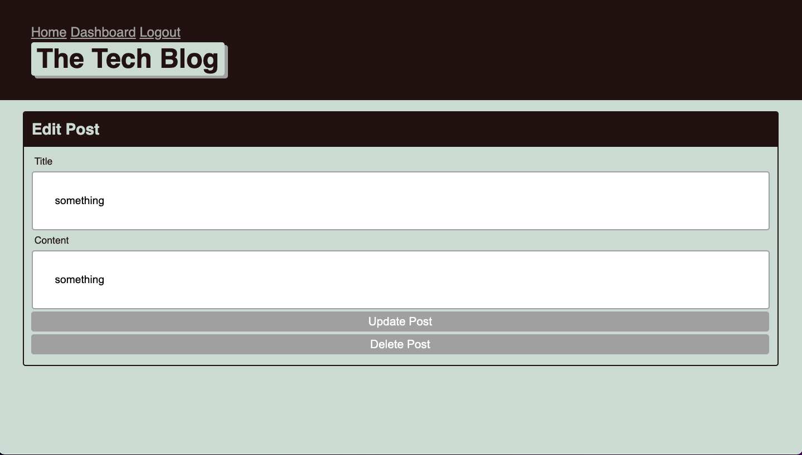

# tech_blog

This is a blog style site where a user can create, edit, and delete posts. They are abel to share with other users who are logged in to the account.
> Live demo [_here_](https://tech-blog253.herokuapp.com/). <!-- If you have the project hosted somewhere, include the link here. -->

## Table of Contents
* [General Info](#general-information)
* [Technologies Used](#technologies-used)
<!-- * [Features](#features) -->
* [Screenshots](#screenshots)
* [Setup](#setup)
* [Usage](#usage)
<!-- * [Project Status](#project-status)
* [Room for Improvement](#room-for-improvement)
* [Acknowledgements](#acknowledgements) -->
* [Contact](#contact)
<!-- * [License](#license) -->

## General Information
The Tech Blog should allow other developers to share information that they have learned from previous issues that they have come across. By doing this, the site becomes a social media arena where ideas and solutions to problems can be communicated and resolved.
<!-- You don't have to answer all the questions - just the ones relevant to your project. -->

## Technologies Used
- MySQL 
- Node.js 
- Handlebars
- Express.js
- bcrypt
- Sequelize
- dotenv

<!-- ## Features
List the ready features here:
- Awesome feature 1
- Awesome feature 2
- Awesome feature 3 -->

## Screenshots

<!-- If you have screenshots you'd like to share, include them here. -->

## Setup
Dependencies for this project are located in the [package.json](package.json) file under dependencies.

Make sure all the dependencies listed below are installed:

`"dependencies": {
    "bcrypt": "^5.0.0",
    "connect-session-sequelize": "^7.0.4",
    "dotenv": "^8.2.0",
    "express": "^4.17.1",
    "express-handlebars": "^5.2.0",
    "express-session": "^1.17.1",
    "mysql2": "^2.2.5",
    "sequelize": "^6.13.0"
  }`

## Usage
To begin run..

 `npm install`

 to install dependencies.

 Then run... 

 `npm start`

 to run the server you local computer.

<!-- ## Project Status
Project is: _in progress_ / _complete_ / _no longer being worked on_. If you are no longer working on it, provide reasons why.

## Room for Improvement
Include areas you believe need improvement / could be improved. Also add TODOs for future development.

Room for improvement:
- Improvement to be done 1
- Improvement to be done 2

To do:
- Feature to be added 1
- Feature to be added 2 -->

<!-- ## Acknowledgements
Give credit here.
- This project was inspired by...
- This project was based on [this tutorial](https://www.example.com).
- Many thanks to... -->

## Contact
Created by [@degrootr253](https://github.com/degrootr253) 

<!-- Optional -->
<!-- ## License -->
<!-- This project is open source and available under the [... License](). -->

<!-- You don't have to include all sections - just the one's relevant to your project -->
